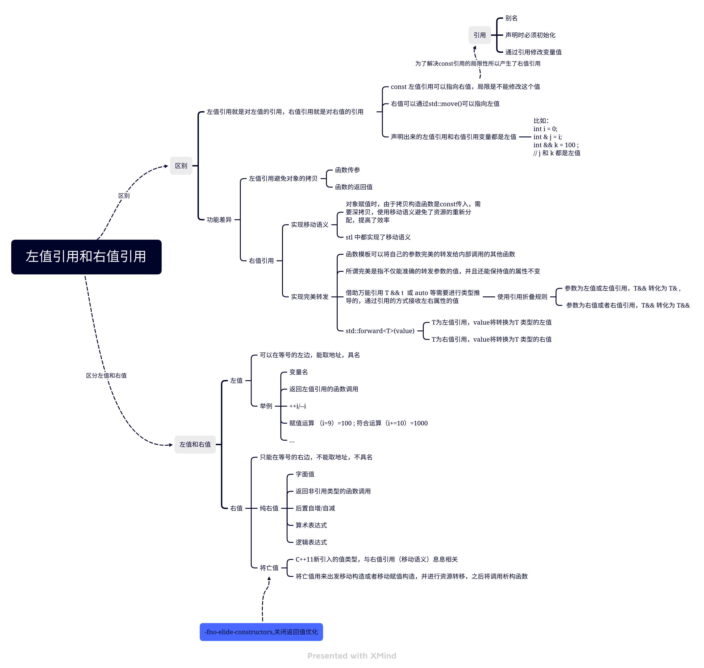

# L/Rvalues(C++)

## 1. Overview

学习视频链接(bilibili)：[Video](https://www.bilibili.com/video/BV1Qt4y1G7SQ/?spm_id_from=333.337.search-card.all.click&vd_source=423d35479f1e9edaeab546e410b16e53)



## 2. Pre-Concepts : 

​	Bit Fields: Classes and Structures can contain members that occupy ==less storage than an integral type==. These members are specified as bit fields.

```cpp
struct Date1 { //bit-field
   unsigned short nWeekDay  : 3;    // 0..7   (3 bits)
   unsigned short nMonthDay : 6;    // 0..31  (6 bits)
   unsigned short nMonth    : 5;    // 0..12  (5 bits)
   unsigned short nYear     : 8;    // 0..100 (8 bits)
};
//sizeof(Date1) = 4;

struct Date2 {
   unsigned short nWeekDay  ;       //0..     (16bits)
   unsigned short nMonthDay ;    
   unsigned short nMonth    ;    
   unsigned short nYear     ;    
};
//sizeof(Date2) = 8
```


---

## 3. Value category

​	Personal Understanding ：Every C++ expression has a type , and belongs to a **value category** . The value categories are the basis for rules that compilers must follow when creating , copying , and moving temporary objects during expression evaluation.[Microsoft concepts](https://learn.microsoft.com/en-us/cpp/cpp/lvalues-and-rvalues-visual-cpp?view=msvc-170)

The C++ 17 standard defines expression value categories as follows:

- A **glvalue** is an expression whose evaluation determines the identity of an object , bit-field , or function.
- A **prvalue** is ans expression whose evaluation initializes an object or a bit-field , or computes the value of the operand of an operator , as specified by the context in which it appears.
- An **xvalue** is a glvalue that denotes an object or bit-field whose resources can be reused(usually because it is near the end of its lifetime).Example : Certain kind of expressions involving rvalue references yield xvalues , such as a call to function whose return type is an rvalue reference or a cast to an rvalue reference type.
- An **lvalue** is a glvalue that is not an xvalue.
-  An **rvalue** is a prvalue or an xvalue.


An lvalue has an address that your program can access . Examples of lvalue expressions include variable names , including ```const``` variables , array elements , function calls that return an value reference , bit -fields , unions , and class members.

A prvalue expression has no address that is accessible by your program. Examples of prvalue expression include literals , function calls that return a non-reference type , and temporary objects that are created during expression evaluation but accessible only by the compiler.

An xvalue expression has an address that no longer accessible by your program but can be used to initialize an rvalue reference , which provides access to the expression. Examples include function calls that return an rvalue reference , and the array subscrip.(与移动语义息息相关)

> tips : close RVO ```-fno-elide-constructors``` 

```cpp
class A{
public:
    A(){
        cout<<"A constructor\t"<<this<<endl;
    }
    ~A(){
        cout<<"A destructor\t"<<this<<endl;
    }
    A(const A& a){
        cout<<"A copy constructor\t"<<this<<endl;
    }
    A& operator =(const A &){
        cout<<"A copy assignment constructor\t"<<this<<endl;
    }
    A(A&& ){
        cout<<"A move constructor\t"<<this<<endl;
    }
    A& operator=(A&&){
        cout<<"A move assignment constructor\t"<<this<<endl;
    }
};

A createA(){
    A a;
    return a;
}

int main(int argc , char ** argv){
        A a = createA(); //createA() 会创建一个临时对象
    	cout<<"end of program."<<endl;
  		return 0;
}
```

Guess with `-fno-elid-constructors` :

​	flow:  constructor --> move constructor --> destructor --> move constructor -->destroctor-->end of program --> destructor;

## 4. L/Rvalue Reference:

​	Both of Lvalue-ref and Rvalue-ref is Lvalue . 

```cpp
A a , b;
A& lref = a;
A&& rref = std::move(b);
//lref and rref is lvalue
```


## 5. Perect Forward

完美转发：函数可以将自己的参数完美的转发给内部调用的函数，完美是指不仅能转发参数的值，还可以转发函数值的类型。实现这个技术使用到了万能引用；

万能引用：涉及到两个方面一个是引用折叠规则来负责接受参数,中间还需要涉及到forword; 如果没有forward那么由于左值引用和右值引用都是左值，都只会出发处理左值的函数；

引用折叠规则：给函数收参数(只负责接受问题)

```cpp
int n = 10;
revode(n)  --> int && t ->int& t
revoke(static_cast<int &> (n))  --> int & && t =>int & t;
revoke(static_cast<int &&> (n))  -->int && &&t  => int && t;
```

std::forward<T>(v) : 

​	如果T为左值引用，v将转换为T类型的左值 ；如果T为右值引用，v将转换为T类型的右值；